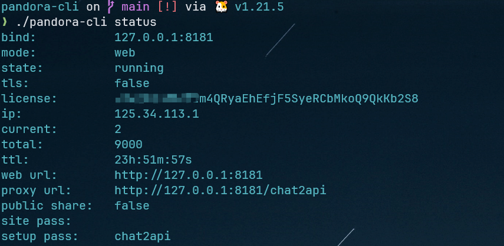
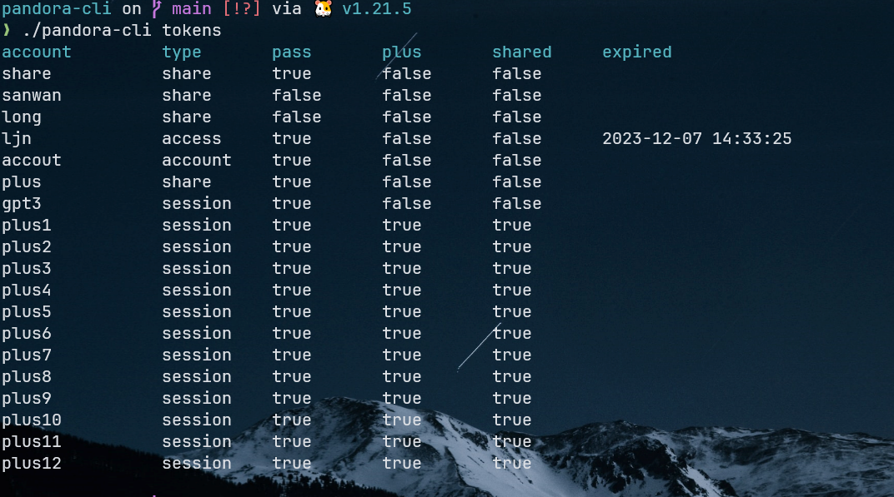
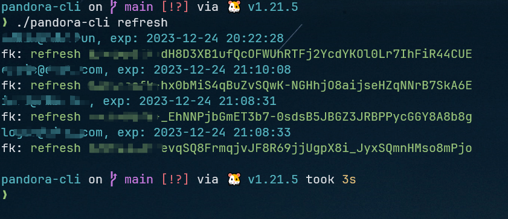
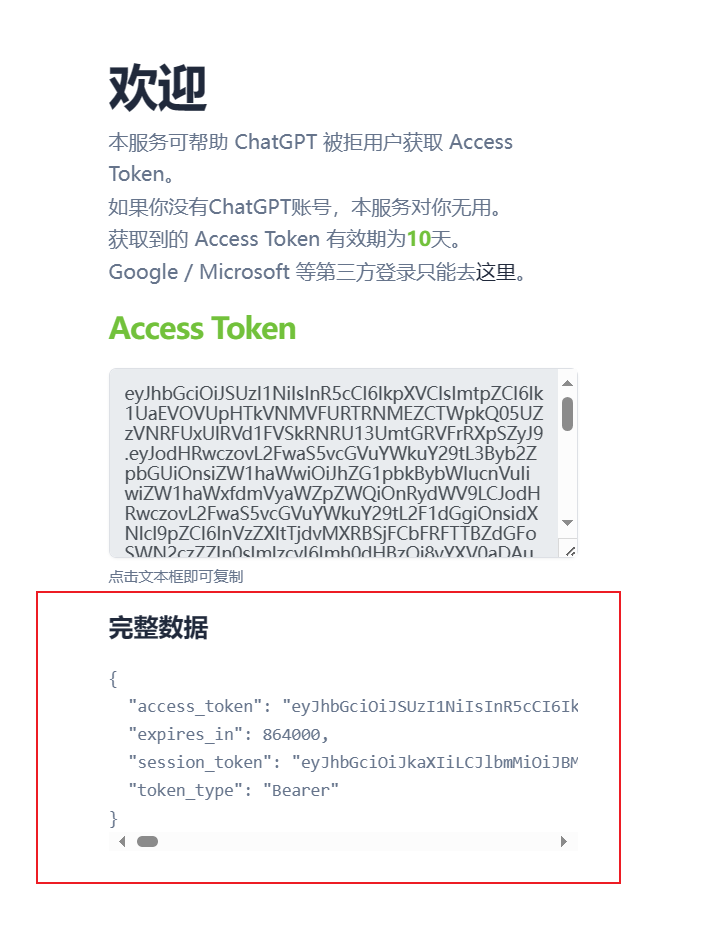

# Pandora Cli
## 简单介绍
Pandora Cli 基于 PandoraNext 开发的命令行工具。实现了以下功能

- 查看 Pandora-Next 的运行状态，额度使用情况
- 重载 Pandora-Next 程序
- 查看 tokens.json 的列表
- 自动刷新 share token，永久有效
- 自动登陆账号

## 使用方式
accounts.json 文件介绍

```json
{
    "admin@gmail.com": {
        "password": "password",
        "share": {
            "fk1": {
                "token_key": ""
            },
            "fk2": {
                "token_key": ""
            },
        }
    }
}
```

- admin@gmail.com: chatgpt 的账号
- password: chatgpt 密码
- share.fk: share token 的名字
- share.fk.token_key: share token 的key

## 安装
打开安装了 PandoraNext 目录，下载对应的 release 文件，修改 accounts.json.demo 为 accounts.json

示例:
``` bash
wget https://github.com/ljnchn/pandora-cli/releases/download/v0.01/pandora-cli-linux386-0.01.tar.gz

cp accounts.json.demo accounts.json

./pandora-cli

```

## 使用命令


- 查看 PandoraNext 服务状态
`./pandora-cli status`

- 查看 token.json 列表
`./pandora-cli tokens`

- 重载配置
`./pandora-cli relaod`

- 刷新 share token
`./pandora-cli refresh`

- 登陆账号
`./pandora-cli login`


### 查看 PandoraNext 服务状态
```bash
./pandora-cli status
```
显示 config.json 中设置的参数，以及额度信息


### 查看 token.json 列表
```bash
./pandora-cli tokens
```
显示 tokens.json 中的账户信息


### 重载配置
```bash
./pandora-cli reload
```
重载当前服务的config.json、tokens.json等配置

### 刷新 share token
```bash
./pandora-cli refresh
```
根据session token(有效期三个月)更新 accounts.json 中每个账号下 share token
需要确保在 sessions 文件夹下面有对应的 session

### 登陆账号
#### 自动登陆
```bash
./pandora-cli login
```
调用 ./pandora-cli login 命令
登陆 accounts.json 下面的账号

自动遍历 accounts.json 中的账号登陆，并将结果自动保存在 sessions 文件夹下面

#### 手动登陆
由于登陆接口每次消耗100额度，建议可以在[fakeopen](https://ai.fakeopen.com/auth1)登陆，然后将结果的完整数据以账户.json（admin@gamil.com.json）保存在同目录 sessions 文件夹下

